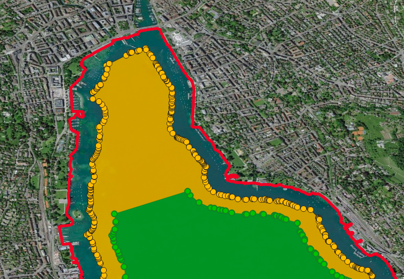
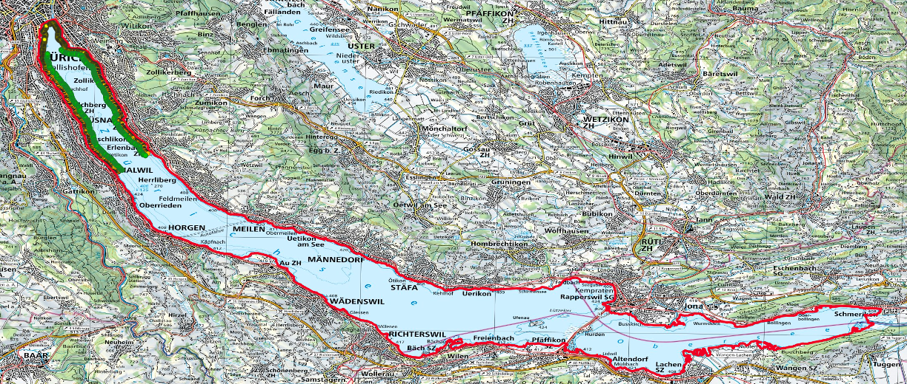
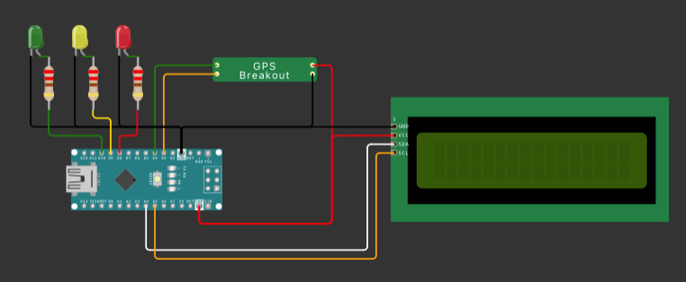

# Lakezones Geofence
 Check in wich zone you are and what you are allowed to do:

## Table of Contents:
[1. Introduction (Summary)](#1-introduction-summary)  
[2. My goals for this project](#2-my-goals-for-this-project)  
[3. Usecase](#3-usecase)  
[4. How does it work?](#4-how-does-it-work)  
&nbsp;&nbsp;[4.1 Create the map](#41-create-the-map)  
&nbsp;&nbsp;[4.2 Create the Hardware](#42-create-the-hardware)  
&nbsp;&nbsp;[4.3 Create the software](#43-create-the-software)  
[5. My tests](#5-my-tests)  
[6. Conclusion](#6-conclusion)  

## 1. Introduction (Summary)

## 2. My goals for this project

## 3. Usecase

## 4. How does it work?

### 4.1 Create the map
1. Open QGIS and import the base file "BASEMAP_Swisstopo_Lakes_WGS84.geojson"
2. Duplicate the layer, toggle edit and delete all lake that you don't want to work on. Rename the layer e.g. "LakeZurich"
3. Toolbox -> Reproject to "EPSG:2056 - CH1903+ / LV95" -> so we can buffer by meter -> temporary layer is enough
4. Toolbox -> Buffer to -150m and -300m. Temporary is enough. We need 
5. Toolbox -> Reproject to "WGS84" both. and save the them to Geopackage named e.g. "LakeZurich-150m_WGS84" and "LakeZurich-300m_WGS84"
   // before continuting with the next step. Have a look at optional 2 (Manipulation the created zones)
7. Toolbox -> Vertics and save the them to Geopackage named e.g. "LakeZurich-150m_Vertics_WGS84" and "LakeZurich-300m_Vertics_WGS84"
SAVE!

**Optional**
If you want to create background maps/ images. Do it with WMS
Link: https://wms.geo.admin.ch/?VERSION=1.3.0&LAYERS=ch.bafu.bundesinventare-bln&STYLES=default&CRS=EPSG:2056&BBOX=2550000,1060000,2660000,1140000&WIDTH=800&HEIGHT=582  

1. SWISS IMAGES
2. 100'000

**Optional 2** - Manipulation and reduction (if you do it before converting it to Vertics, you just have to do it once.)
If you are using a not so powerfull board to run the script, you need to reduce the count of points. The most effective method for is to narrow down your polygons.
1. Choose the Map you want to work on
2. Toggle Editing 
3. Click on the Vertex-Tool
4. Change everything that you like - Change the zones/ Delete Points

For example the "Seebecken in Zurich has a special rule wich allign with the rule for the first 150m from shore. So I just deleted the part of the 300 zone.

Here you also can see the vertics, that describe the polygon. Its basicly nothing else then the points where the outline of the polygone changes its direction.

 
 
 
Since I am using a Arduino Nano for my project, i need to reduce the count of the points. I decided to not simplify the form, to keep the accuracy, and just keep the part, where I will be mainly using it.
So Area between Zurich and Thalwil. (4265 Point reduced to around 600)
 
 

Create a list with points: 
-> Attribute table
-> Python script

### 4.2 Create the Hardware

**What you need:**
- Arduino (Nano)
- GPS-Modul
- 3 LEDs (red/yellow/green)
- 3 resistors (220 Ω)
- LCD Display (optional)
- Power Source (PowerBank with cable)
- Several calbes to solder or pin the circutes

Create a copy of the **Wokwi project** and modify it according to your needs: [https://wokwi.com/projects/396244731597052929](https://wokwi.com/projects/396244731597052929)

### 4.3 Create the software

Find the script for the arduino [here](Arduino_Scripts/CheckCoordinatesSpeedBlinking10.ino). The script is commented and filled with sample coordinates of Lake Zurich.

The software setup for this project involves the following key components and steps:

Initialization
The system initializes by setting up the libraries needed for GPS data processing (TinyGPS++), serial communication (SoftwareSerial), and LCD display control (LiquidCrystal_I2C). It configures the pins for the GPS module, LEDs, and LCD, and establishes serial connections for both GPS data reception and debugging output.

GPS Data Processing
The software continuously reads from the GPS module, parsing latitude, longitude, and speed using the TinyGPS++ library. This parsed data drives the application's logic flow.

Geofencing with Ray-Casting
Utilizing the Ray-Casting algorithm, the software determines the presence of the device within predefined polygonal geofences. Based on the device's location:

Red LED indicates outside both polygons.
Yellow LED signals presence within the larger polygon.
Green LED lights up within the smaller polygon at speeds over 40 km/h.
LED and LCD Management
LED behavior is controlled based on the geolocation data and speed, with LEDs blinking faster at higher speeds. The LCD displays real-time updates of the current geographical coordinates. The software employs non-blocking delay techniques using millis() to manage LED blinking without halting the system.

This streamlined approach ensures efficient data handling and responsive output through the hardware interfaces, integrating technical operations into a cohesive system.

## 5. My tests

## 6. Conclusion
