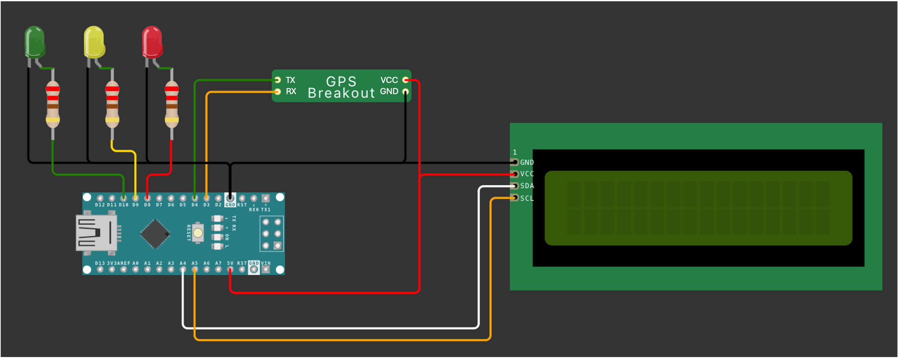

# Lakezone Geofence

## Table of Contents:
[1. Introduction](#1-introduction)  
[2. My goals for this project](#2-my-goals-for-this-project)  
[3. Usecase](#3-usecase)  
[4. How does it work?](#4-how-does-it-work)  
&nbsp;&nbsp;[4.1 Create the map](#41-create-the-map)  
&nbsp;&nbsp;[4.2 Create the Hardware](#42-create-the-hardware)  
&nbsp;&nbsp;[4.3 Create the software](#43-create-the-software)  
[5. My tests](#5-my-tests)  
[6. Conclusion](#6-conclusion)  
[7. Credits](#6-conclusion)  

 
 

 ## 1. Introduction
Navigating water bodies comes with its own set of regulations, just like on roads. Special rules govern the shore zones of lakes to protect swimmers, stand-up paddleboarders, and wildlife. However, estimating distances on water without fixed points can be challenging. It's easy to unintentionally exceed speed limits or enter restricted zones. To address this, the Lakezone Geofence project provides a solution for accurately determining one's current zone on the water.

## 2. My goals for this project

## 3. Usecase
The Lakezone Geofence project serves a critical use case scenario, particularly relevant for inland water bodies like lakes, where diverse zones necessitate adherence to specific regulations. Especially in regions like Switzerland, where stringent penalties accompany violations, ensuring compliance with rules aimed at safeguarding swimmers, paddleboarders, and aquatic life becomes paramount.

Consider scenarios involving boat operators, including both recreational users and professionals such as coaches of junior teams. Accurately estimating distances from shorelines is essential to avoid inadvertently breaching speed limits or entering restricted areas. While experienced operators may manage this task effectively, frequent repetitions or distractions can increase the risk of unintentional rule violations.

Traditional methods of enforcing these regulations, such as using binoculars with integrated distance meters or relying on chart plotters with manually marked 300-meter zones, present limitations in precision and efficiency. Enter the Lakezone Geofence project, offering a solution to these challenges.

By leveraging GPS technology and polygonal geofencing techniques, the project enables real-time determination of the vessel's location relative to predefined zones. This information is crucial for both boat operators and water authorities. Boat operators benefit from immediate feedback on their location and adherence to regulations through visual indicators such as LED lights. Additionally, the system dynamically checks the vessel's speed against the prescribed speed limit for the current zone, enhancing safety measures further. Conversely, water authorities can utilize this technology for efficient monitoring and enforcement efforts, ensuring enhanced safety and compliance across water bodies.

The Lakezone Geofence project not only facilitates adherence to regulations but also streamlines operational workflows for boat operators and enhances safety measures, ultimately contributing to a more secure and harmonious recreational and professional boating environment.

## 4. How does it work?

### 4.1 Create the map
1. Open QGIS and import the base file "BASEMAP_Swisstopo_Lakes_WGS84.geojson"
2. Duplicate the layer, toggle edit and delete all lake that you don't want to work on. Rename the layer e.g. "LakeZurich"
3. Toolbox -> Reproject to "EPSG:2056 - CH1903+ / LV95" -> so we can buffer by meter -> temporary layer is enough
4. Toolbox -> Buffer to -150m and -300m. Temporary is enough. We need 
5. Toolbox -> Reproject to "WGS84" both. and save the them to Geopackage named e.g. "LakeZurich-150m_WGS84" and "LakeZurich-300m_WGS84"
   // before continuting with the next step. Have a look at optional 2 (Manipulation the created zones)
7. Toolbox -> Vertics and save the them to Geopackage named e.g. "LakeZurich-150m_Vertics_WGS84" and "LakeZurich-300m_Vertics_WGS84"
SAVE!

**Optional**
If you want to create background maps/ images. Do it with WMS
Link: https://wms.geo.admin.ch/?VERSION=1.3.0&LAYERS=ch.bafu.bundesinventare-bln&STYLES=default&CRS=EPSG:2056&BBOX=2550000,1060000,2660000,1140000&WIDTH=800&HEIGHT=582  

1. SWISS IMAGES
2. 100'000

**Optional 2** - Manipulation and reduction (if you do it before converting it to Vertics, you just have to do it once.)
If you are using a not so powerfull board to run the script, you need to reduce the count of points. The most effective method for is to narrow down your polygons.
1. Choose the Map you want to work on
2. Toggle Editing 
3. Click on the Vertex-Tool
4. Change everything that you like - Change the zones/ Delete Points

For example the "Seebecken in Zurich has a special rule wich allign with the rule for the first 150m from shore. So I just deleted the part of the 300 zone.

Here you also can see the vertics, that describe the polygon. Its basicly nothing else then the points where the outline of the polygone changes its direction.

 
 
 
Since I am using a Arduino Nano for my project, i need to reduce the count of the points. I decided to not simplify the form, to keep the accuracy, and just keep the part, where I will be mainly using it.
So Area between Zurich and Thalwil. (4265 Point reduced to around 600)
 
 

**Create a list with points for the software:**
Export the Attribute table
1. right click on the layer with vertics
2. "just show feature visible on map" (bottom left)
3. Click "open Attribute Table"
4. Open fiel calculator
5. Create new field (Expression: "x($geometry)")
6. Repeat with (Expression: "y($geometry)")
7. Check the x and y column
8. Close the Attribute table
9. Right click on the layer and click "Export" & "Save Feature as..."
10. Save as CSV

**Restructure the List of Points, so it can be copyed and pasted into the arduino script**
1. Open the python script "CreateListOfPoints.py"
2. Change the paths to your previously created csv's
3. Run the script
4. Copy the output to your software and replace the existing coordinates (WATCH OUT! Don't swap X and Y)

### 4.2 Create the Hardware

**What you need:**
- Arduino (Nano)
- GPS-Modul
- 3x LEDs (red/yellow/green)
- 3x resistors (220 Ω)
- LCD Display (optional)
- Power Source (PowerBank with cable)
- Several cables to solder or pin the circuits.

**Circuit diagram**

Create a copy of the **Wokwi project** and modify it according to your needs: [https://wokwi.com/projects/396244731597052929](https://wokwi.com/projects/396244731597052929)

### 4.3 Create the software

Find the script for the arduino [here](Arduino_Scripts/CheckCoordinatesSpeedBlinking10.ino). And requirements [here](Arduino_Scripts/requirements.txt). The script is commented and filled with sample coordinates of Lake Zurich.

The software setup for this project involves the following key components and steps:

**Initialization**  
The system initializes by setting up the libraries needed for GPS data processing (TinyGPS++), serial communication (SoftwareSerial), and LCD display control (LiquidCrystal_I2C). It configures the pins for the GPS module, LEDs, and LCD, and establishes serial connections for both GPS data reception and debugging output.

**GPS Data Processing**  
The software continuously reads from the GPS module, parsing latitude, longitude, and speed using the TinyGPS++ library. This parsed data drives the application's logic flow.

**Geofencing with Ray-Casting**  
Utilizing the Ray-Casting algorithm, the software determines the presence of the device within predefined polygonal geofences. Based on the device's location:
- Red LED indicates outside both polygons.
- Yellow LED signals presence within the larger polygon.
- Green LED lights up within the smaller polygon.

**LED and LCD Management**  
LED behavior is controlled based on the geolocation data and speed, with LEDs blikin, when the allowed speed is exceeded (10 km/h - red / 10 km/h - yellow / 40 km/h - green) . The LCD displays real-time updates of the current geographical coordinates. The software employs non-blocking delay techniques using millis() to manage LED blinking without halting the system.

This streamlined approach ensures efficient data handling and responsive output through the hardware interfaces, integrating technical operations into a cohesive system.

## 5. My tests
Throughout the development and implementation phases of the Lakezone Geofence project, extensive testing was conducted to ensure functionality, accuracy, and reliability. Multiple iterations were necessary, each requiring careful troubleshooting to address various challenges and ensure optimal performance.

One crucial aspect of the testing process involved verifying the accuracy of zone detection and LED signaling. The system accurately identified and distinguished between different zones, signaling their presence through the appropriate LED color—red for outside both polygons, yellow for within the larger polygon, and green for within the smaller polygon. This functionality was critical for providing real-time feedback to boat operators regarding their location relative to regulatory zones.

Another significant aspect of testing focused on speed limit enforcement within each zone. The system dynamically checked the vessel's speed against the prescribed speed limit for the current zone, triggering LED blinking when the allowed speed was exceeded. Testing confirmed that the speed measurements aligned with those of common speedometers, ensuring accurate enforcement of speed regulations.

Practical considerations were also taken into account during testing. Utilizing IKEA boxes as ideal containers for prototypes proved beneficial, offering waterproof enclosures with ample space for components. Additionally, replacing traditional LEDs with "Glow-worms" from AliExpress enhanced visibility, particularly in bright sunlight, improving overall functionality and usability.

Overall, the testing process validated the effectiveness and reliability of the Lakezone Geofence project. From accurate zone detection and LED signaling to precise speed limit enforcement, the system demonstrated its ability to enhance safety and compliance for boat operators on inland water bodies.

## 6. Conclusion
- Es war sehr interessant herauszufinden, wie man Karten entsprechend bearbeiten kann, um sie in eine Probgrammierung einzubinden.
- Der schwersste Teile, war die Karte für die Programmierung bereitzustellen. Als zwischenschritt habe ich die aktuelle GPS Position auf dem Display ausgegeben, ohne die Zone zu prüfen. Das war leicht.
- Der Unique Selling Point ist nicht gegeben. Eine kommerzielle Verwertung des Projektes hätte keinen Erfolg, da die Wasserschutzpolizei auch nicht genau kontrolliert, sondern auf den guten Menschenverstand abzielt.

## 7. Credits
- [Yves Maurer Weisbrod](https://www.linkedin.com/in/yves-maurer-weisbrod/) - Thank you very much for the introduction to the world of QGIS and working with maps as part of the module "Geospatial data" in the MSc Data Science program at HSLU.
- [Juliette Wicki](https://www.linkedin.com/in/juliette-wicki-7b9885273/) - Thank you so much for answering all my GIS questions!
